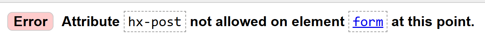

# Dropped Kerb Mapper Testing

[Back to the README.md file](https://github.com/SonyaJane/dropped-kerb-mapper#dropped-kerb-mapper)  

[Back to the Testing section in the README.md file](https://github.com/SonyaJane/dropped-kerb-mapper#testing)

[View the live website here](https://www.droppedkerbmapper.com/)  

## Table of Contents

## Testing User Stories

1. **Add a dropped kerb location**  
   As a Site User I want to add the location of a dropped kerb by clicking on a map so that I can contribute accurate data to the database.  

   **Acceptance Criteria**  
   - An interactive map is displayed on the submission page.  
   - Clicking on the map places a marker at the chosen point.  
   - The latitude and longitude of the marker are captured in the form.  

2. **Categorise the condition**  
   As a Site User I want to classify the dropped kerb using a traffic-light system so that others know its usability.  
   **Acceptance Criteria**  
   - The form shows a dropdown box with five options: None (default), Red, Orange, Green, or White.  
   - One option can be selected.  

3. **Provide reasons for the classification**  
   As a Site User I want to supply one or more contextual reasons for my condition choice so that I can explain my assessment.  
   **Acceptance Criteria**  
   - If the user selects Red or Orange, a dropdown list appears with relevant reasons or characteristics explaining the selected category.  
   - The user can select multiple reasons to provide context.

4. **Upload a photo**  
   As a Site User I want to optionally upload a photo of the dropped kerb so that others can visually verify its condition, and wheelers can judge for themselves if they can use it.
   **Acceptance Criteria**  
   - The form accepts image files (jpg, png, webp).  
   - Uploaded images are converted to WebP and compressed.  
   - Photo upload is optional but validated if provided. 

5. **Receive submission confirmation**  
   As a Site User I want to see a success message when my report is saved so that I know my contribution is recorded.  
   **Acceptance Criteria**  
   - On valid submission, an HTMX partial confirms success inline.  
   - The new marker appears on the map without a full page reload.  

6. **Register and log in**  
   As a Site User I can register an account and log in so that I can create, view, edit, and delete my own reports.  
   **Acceptance Criteria**  
   - Users sign up with email and password.  
   - Email confirmation link auto-confirms and logs the user in.  

7. **Edit a report**  
   As a Site User I want to edit my existing report so that I can correct mistakes or update information.  
   **Acceptance Criteria**  
   - The edit form is pre-populated with the original data.  
   - On valid update, a success message displays and redirects to detail view.  

8. **Delete a report**  
   As a Site User I want to delete my own report so that I can remove obsolete or erroneous entries.  
   **Acceptance Criteria**  
   - Only the owner or a superuser may delete.  
   - After deletion, the user is redirected to the reports list with a success message.  

9. **View a map of reports**  
   As a Site User I want to see all my reports plotted on an interactive map so that I can visualise their locations.  
   **Acceptance Criteria**  
   - Markers are colour-coded by condition.  
   - Clicking a marker shows a summary popup with thumbnail and condition.

10. **Contact support**  
    As a Site User I want to send feedback or questions via a contact form so that I can communicate with the site team.  
    **Acceptance Criteria**  
    - The contact page shows a form asking name, email, and message.  
    - On valid submission, emails are sent to the admin and a confirmation to the user.  
    - A success message displays on the contact page.  
  
11. **Filter and search reports (admin)**  
    As a Site Admin I want to filter and search all reports by date, user, location, or condition so that I can manage the data.  
    **Acceptance Criteria**  
    - The django admin interface provides sidebar filters for condition, reasons, user, and date.  
    - A search box allows keyword lookup in reasons and comments.  

12. **Proxy map tiles**  
    As a user the app should load consistent map tiles so that I see the same Ordnance Survey and Google Satellite imagery.  
    **Acceptance Criteria**  
    - OS raster tiles are served via the `/os_tiles/…/` endpoint with caching headers.  
    - Google satellite tiles use a valid session token and return proper cache controls on 404.  

## Manual Testing

* Browser Compatibility

Browser | Outcome | Pass/Fail  
--- | --- | ---
Google Chrome | No appearance, responsiveness nor functionality issues.| Pass
Mozilla Firefox | No appearance, responsiveness nor functionality issues. | Pass
Microsoft Edge | No appearance, responsiveness nor functionality issues. | Pass

* Device compatibility

Device | Outcome | Pass/Fail
--- | --- | ---
Lenovo Legion Slim 7 | No appearance, responsiveness nor functionality issues. | Pass
iPad Pro 11" | No appearance, responsiveness nor functionality issues. | Pass
Samsung Galaxy Ultra 22 | No appearance, responsiveness nor functionality issues. | Pass

* Elements Testing

**Common Elements**

Feature | Outcome | Pass/Fail
--- | --- | ---
Navigation Bar | Link is working as expected. | Pass
Menu | Links are working as expected. | Pass
| Button hover effects | Changes colour on hover, cursor changes to pointer | Pass |
Footer | Hover effects and social media links are working as expected. | Pass

**Home Page**

| Feature | Outcome | Pass/Fail |
|---|---|---|
| Hero image | Visible at the top of the page | Pass |
| Hero section cover title | Cover text is visible at the top of the page on the hero image | Pass |
| Call to action buttons (Not logged in)  | Sign In and Create Account buttons appear for unauthenticated users and on click work as expected | Pass |
| Call to action buttons (Logged in) | Create Report and Instruction buttons appear for authenticated users and on click work as expected | Pass |
| Welcome section and How to Contribute sections | Present and visible | Pass |
| Instructions link | Navigates to the instructions page | Pass |

**Instructions**

| Feature | Outcome | Pass/Fail |
|---|---|---|
| Instructions text | Visible at the top of the page | Pass |
| Images | Cover text is visible at the top of the page on the hero image | Pass |
| Call to action buttons (Not logged in) | Sign In and Create Account buttons appear for unauthenticated users and on click work as expected | Pass |
| Call to action buttons (Logged in) | Create Report button appears for authenticated users and on click work as expected | Pass |

**Contact**

| Feature | Outcome | Pass/Fail |
|---|---|---|
| Contact heading and text | "Contact Us" heading and text is visible  | Pass |
| Contact form | Form is displayed when no message has been sent | Pass |
| Form fields | All required fields are present | Pass |
| Field prepopulated | First name, last name and email address pre filled and not editable when user logged in | Pass |
| Crispy form styling | Form is rendered using crispy-forms for consistent Bootstrap styling | Pass |
| Submit button | Send Message button is present and enabled when form is valid | Pass |
| Form validation | Invalid submissions show error messages and do not submit | Pass |
| Confirmation email | Confirmation email is sent after submitting the form | Pass |
| Message sent to site owner | Email containing the form contents is sent to the site owner after form is submitted | Pass |
| Django system success message | 'Message submitted successfully!' flashed at top of page on successful form submission | Pass |
| Form replaced | Form replaced with "Thank you for your message!" after successful form submission. | Pass |

**Create Account**

| Feature | Outcome | Pass/Fail |
|---|---|---|
| Create account heading | "Create an account" heading is visible | Pass |
| Introductory text | Instructions for creating an account are shown | Pass |
| Sign in link | Link to sign in is present and navigates to sign in page | Pass |
| Signup form visible | Signup form is displayed with all required fields | Pass |
| Form uses crispy forms | Form is rendered using crispy-forms for Bootstrap styling | Pass |
| Mobility device field | Only shows if user selects yes for either of the questions about a wheeled mobility device | Pass |
| Submit button | Submit button is present and enabled when form is valid | Pass |
| Form validation | Invalid submissions show error messages and do not submit | Pass |
| Email signup link | Email sent to user with link to click for email address confirmation | Pass |
| Email confirmed | Email confirmed page shown on email link click  and user automatically logged in| Pass |

**Add Report Page**

| Feature | Outcome | Pass/Fail |
|--- | --- | --- |
| Map displays on page load | Interactive map is visible and loads correctly, centering on the user's location | Pass |
| Search location | Search input and button are present and functional | Pass |
| Search results | Panel displayed and functions as expected | Pass |
| Search result selection | Point or area displayed on map and results panel removed | Pass |
| Geolocation button | Geolocation button is visible and centers the map on the user's location when clicked| Pass |
| Toggle satellite button | Toggle satellite button switches between map view and satellite map view. Button turns orange when in satellite view. | Pass |
| Add report button | Add report button is visible and toggles new report mode | Pass |
| Markers for existing reports | All user reports are shown as markers on the map | Pass |
| Marker popup | Clicking a marker shows a popup with report details | Pass |
| Add new report by clicking map | Clicking the map in add mode opens the report form at that location | Pass |
| Report form validation | Invalid submissions show error messages and do not submit | Pass |
| Report form submission | Valid submissions add a new marker and show a success message, which disappears after 5 seconds | Pass |
| Edit marker location | Marker can be dragged to update location on double clicking on the marker | Pass |
| Responsive layout | Map and controls display correctly on all screen sizes | Pass |

**Reports List Page**

Feature | Outcome | Pass/Fail
--- | --- | ---
| Reports table visible | Table of reports is displayed on the page | Pass |
| Title correct for user type | "All Reports" shown for superuser, "Your Reports" for regular user | Pass |
| Table columns correct | Columns match user type | Pass |
| Pagination works | Table paginates if there are many reports | Pass |
| Sorting works | Clicking column headers sorts the table | Pass |
| Photo icon/thumbnail | Photo icon shown if report has a photo and displays photo on click  | Pass |
| Edit link present | Edit link/button is present for each report | Pass |
| View detail link present | Link to view report details is present for each report | Pass |
| Responsive layout | Table and controls display correctly on all screen sizes | Pass |

**Report Detail Page**

Feature | Outcome | Pass/Fail
--- | --- | ---
| Report access | Report only shows for user who created it and superusers | Pass |
| Report heading | Shows correct report number for user type (ID for superuser, user_report_number for regular user) | Pass |
| Report details table | Table displays latitude, longitude, place, county, condition, reasons, comments, created/updated dates | Pass |
| Reasons display | Reasons are shown and formatted, or "None" if not present | Pass |
| Comments display | Comments are shown, or "None" if not present | Pass |
| Photo display | Photo is shown if present, otherwise "No photo available" message | Pass |
| Created by (superuser) | "Created by" row is visible for superusers | Pass |
| Edit button | Edit button is visible for owner or superuser and links to edit page | Pass |
| Delete button | Delete button is visible for owner or superuser and opens confirmation modal. | Pass |
| Go to reports list button | Button links to the reports list page | Pass |
| Create new report button | Button links to the create report page | Pass |
| Delete confirmation modal | Modal appears and allows user to confirm or cancel deletion, Report is successfuly deleted on confirm. | Pass |

**Sign Out**

Feature | Outcome | Pass/Fail
--- | --- | ---
| Sign out page visible | "Sign Out" heading and confirmation message are displayed | Pass |
| Sign out button present | "Sign Out" button is visible and enabled | Pass |
| Cancel/redirect option | Option to cancel or return to previous page is available | Pass |
| Successful sign out | User is logged out and redirected to login page | Pass |
| Success message | "You have signed out." message is displayed after logout | Pass |
| Cannot access user pages after sign out | Accessing authenticated pages redirects to login | Pass |

**Sign In**

Feature | Outcome | Pass/Fail
--- | --- | ---
| Sign in page visible | "Sign In" heading and instructions are displayed | Pass |
| Sign in form present | Email and password fields are visible | Pass |
| Sign in button present | "Sign In" button is visible and enabled | Pass |
| Sign up link present | Link to create an account is visible and navigates to sign up page | Pass |
| Form validation | Invalid submissions show error messages and do not submit | Pass |
| Incorrect password handling | Error message shown for incorrect password | Pass |
| Non-existent email handling | Error message shown for non-existent email | Pass |
| Successful sign in | User is redirected to dashboard or home page after login | Pass |
| Success message | "Successfully signed in" message is displayed after login | Pass |

**Forgot Password**
| Feature | Outcome | Pass/Fail |
|---|---|---|
| Forgot password page visible | "Password Reset" heading and instructions are displayed | Pass |
| Email input field present | Email input field is visible and enabled | Pass |
| CSRF protection | CSRF token is present in the form | Pass |
| Reset button present | "Reset My Password" button is visible and enabled | Pass |
| Form validation | Invalid submissions show error messages and do not submit | Pass |
| Password reset email sent | Password reset email is sent to the user if email exists | Pass |
| Success message | Confirmation message is displayed after submitting the form | Pass |
| Password reset link works | Clicking the link in the email opens the password reset form | Pass |
| New password form validation | New password form validates input and shows errors if invalid | Pass |
| Successful password reset | User can set a new password and log in with it | Pass |

## Code Validation

### HTML

The [W3C Markup Validator](https://validator.w3.org/) was used to validate the project HTML code to ensure there were no syntax errors.
 
W3C Markup Validator found the following errors for the home page:

The errors were solved by removing the second use of the id 'not-logged-in',and adding the id="home-title-md" to the cover title.

W3C Markup Validator found the following errors in the add report (map) page:

**HTMX Attributes**

These are not valid on the `<form>` element itself according to the HTML spec. 
The warning could be avoided by moving the hx-post, hx-target, and hx-swap 
attributes to the submit button inside the form, but we cannot as we use
Crispy to generate the form fields and button.

There were five other errors found in elements generated by Cripsy forms, such as the following:

The label is rendered for a field that is within a hidden container, but this is 
expected here since the form is hidden by default for UX reasons, 
but becomes visible and accessible when the user clicks on the map to add a new report.

### CSS

[W3C CSS Validator](https://jigsaw.w3.org/css-validator/) service was used to validate the CSS code to ensure there were no syntax errors. 

One error was found.

This was fixed by using the longhand properties for SVG masking.

### JavaScript

[JSHints JavaScript Code Quality Tool](https://jshint.com/) was used to validate the JavaScript code. 

Missing colons were found and added.

### Python

Pylint was used continuously during the development process to check the Python code for programming errors.

[The Code Institute Python Linter](https://pep8ci.herokuapp.com/) was also used to validate the Python code 
for PEP8 requirements. The validation results are shown below. All errors were fixed. 

<table>
  <thead>
    <tr>
      <th>Location</th>
      <th>Errors / Warnings</th>
    </tr>
  </thead>
  <tbody>
    <tr>
      <td>./mapper/admin_forms.py</td>
      <td>None</td>
    </tr>
    <tr>
      <td>./mapper/admin.py</td>
      <td></td>
    </tr>
    <tr>
      <td>./mapper/filters.py</td>
      <td></td>
    </tr>
    <tr>
      <td>./mapper/forms.py</td>
      <td></td>
    </tr>
    <tr>
      <td>./mapper/models.py</td>
      <td></td>
    </tr>
    <tr>
      <td>./mapper/signals.py</td>
      <td></td>
    </tr>
    <tr>
      <td>./mapper/tables.py</td>
      <td></td>
    </tr>
    <tr>
      <td>./mapper/urls.py</td>
      <td>None</td>
    </tr>
    <tr>
      <td>./mapper/utils.py</td>
      <td></td>
    </tr>
    <tr>
      <td>./mapper/views.py</td>
      <td></td>
    </tr>
  </tbody>
</table>

## Accessibility

Lighthouse in Chrome DevTools was used to confirm that the colours and fonts used 
in the website are easy to read and accessible. See reports in the table below:

### Lighthouse Reports

<table>
  <thead>
    <tr>
      <th>Page</th>
      <th>Lighthouse Report</th>
    </tr>
  </thead>
  <tbody>
    <tr>
      <td>Home</td>
      <td></td>
    </tr>
    <tr>
      <td>Instructions</td>
      <td></td>
    </tr>
    <tr>
      <td>Contact</td>
      <td></td>
    </tr>
    <tr>
      <td>Create Account</td>
      <td></td>
    </tr>
    <tr>
      <td>Reports List Page</td>
      <td></td>
    </tr>
    <tr>
      <td>Report Detail Page</td>
      <td></td>
    </tr>
    <tr>
      <td>Sign Out</td>
      <td></td>
    </tr>
    <tr>
      <td>Sign In</td>
      <td></td>
    </tr>
    <tr>
      <td>Forgot Password</td>
      <td></td>
    </tr>
    <tr>
      <td>Add Report Page</td>
      <td></td>
    </tr>
  </tbody>
</table>

Note that the low score for performance for the create report page is due to the 
map tiles loading and the map markers being created. Loading time was reduced by 
delaying the creation of the markers popups content until the marker is clicked
by the user. The acessibility score of 96 is due to the aria-labels added to the
markers by MapLibre GL JS. The SEO score of 91 is due to the links not being crawlable
but this is not an issue because this page is only visible to users who are
logged-in.